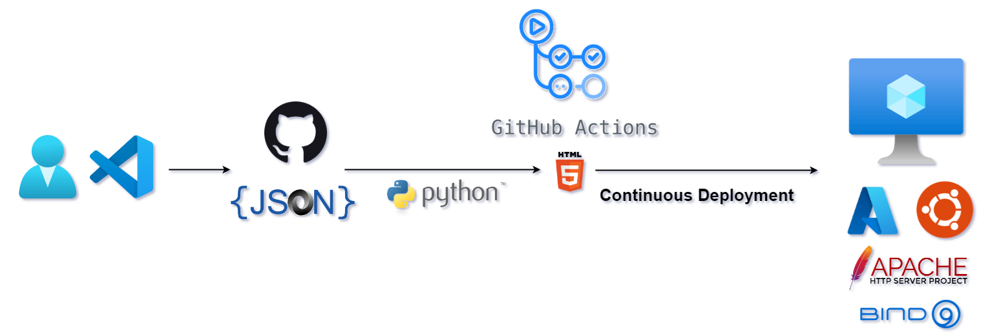
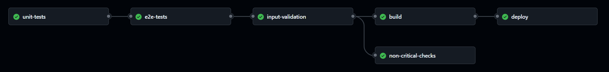

# Automated Webpage Generator from JSON Data

## Overview

This project is designed to automatically generate and deploy a webpage that showcases my course certifications and credentials. The **GitHub Actions CI/CD workflow** processes **JSON** files containing certification data and builds an HTML file using **Python**. The HTML page is then [deployed](https://nyjanos.com/skills.html) to an **Ubuntu** virtual machine hosted on **Azure**, where it is served through an **Apache** webserver.

## Workflow steps

- **Unit Tests**: Runs unit tests on the .py files in the src directory.
- **End-to-End Tests**: Runs end-to-end tests using test input JSON data and test templates, comparing the generated output with the expected result.
- **Input Data Validation**: Validates the input JSON data files.
- **Check for Non-Critical Issues**: Displays warnings about non-critical issues in the input data.
- **Build**: Generates the HTML page from the validated input data and template.
- **Deployment**: Uses a self-hosted runner to deploy the generated page to an Ubuntu server hosted on Azure.

## Branches
- **update/\*\***: making improvements or fixes in the existing codebase
- **feature/\*\***: implementing new functionality
- **data/\*\***: inserting new data into the JSON files
- **failure-scenarios/\*\***: demonstrating how the workflow behaves in case of errors or with invalid/corrupted input data
